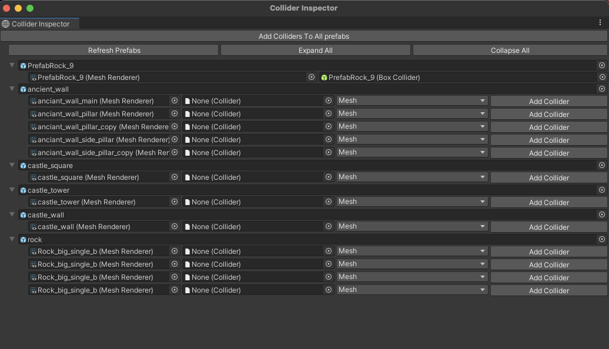

# ColliderTool
> Made a tool that adds collider components to prefabs

# How to use it

- At the top of Unity in Menu Items select **Custom Tool -> Collider Tool**
- Window called Collider Inspector will be opened
- Inspector will show all the prefabs in the project that has mesh renderer in it
- If clicked on button Expand All it will show exactly how many mesh renderer components each prefab has
- If None shown in second collumn that says Collider it means the mesh renderer is missing Collider
- It possible to chose what kind of collider each mesh renderer can have added (box, sphere or mesh)
- It is possible to add Collider one by one to each mesh renderer
- Also possible to automatically add the colliders to all mesh renderers by clicking on top button **"Add Colliders To All prefabs"**
- If your mesh renderer already has collider especially mesh collider it will show an option to make it convex
- If mesh collider is being added to object it will automatically set it to be convex
- Double clicking on prefab will open the prefab
